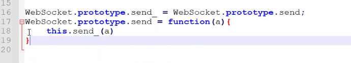

# 1 协议简介

## 1.1 http

- 特点：慢 不够及时 占有服务器资源 短连接
- 步骤
  1. 握手
  2. 发请求
  3. 返回数据
  4. 服务器主动断开连接

## 1.2 socket

> 在数据接收可能会**粘包**

- 粘包类型
  - 数据不全
  - 数据多了
    - 1个包是完整的 + 不完整的包
    - 多个包是完整的 + 不完整的包
  - 数据刚好
- 解决办法
  - 固定长度
    - 比如说```100```个字节
    - ```YY```协议
  - 头尾标识符
    - 比如说```01```开头```05```结尾
    - QQPC端
  - ```TLV```协议
    - 标识符
    - 数据长度
    - 数据

## 1.3 WebSocket

> 粘包浏览器已经解决

- 特点
  - 长链接
  - ```TCP```
- 步骤
  1. ```http```握手
  2. 升级为```websocket```
  3. 升级协议
  4. 连接服务器```wss```的```ip```端口
  5. 等待

# 2 实战

## 2.1 F12抓包

```
// websocket 特有的
Connection: Upgrade  // 升级
Sec-WebSocket-Key: SgM/CmsldAcH3vdzS29RzA==  // 随机生成 一个标识符
Sec-WebSocket-Version: 13  // 版本号
Upgrade: websocket  // 升级为 websocket

// 通用的
Host: wsschatpush.miguvideo.com
Origin: https://www.miguvideo.com
Pragma: no-cache
Sec-WebSocket-Extensions: permessage-deflate; client_max_window_bits
Accept-Encoding: gzip, deflate, br
Accept-Language: zh-CN,zh;q=0.9
Cache-Control: no-cache
User-Agent: Mozilla/5.0 (Windows NT 10.0; Win64; x64) AppleWebKit/537.36 (KHTML, like Gecko) Chrome/108.0.0.0 Safari/537.36
```

## 2.2 案例站 hook

```javascript
// 这个站发数据是 http
e.ws.send_ = e.ws.send()
e.ws.send = function(a) {
    console.log(a)
    e.ws.send_(a)  // 不影响正常的逻辑
}
```

```javascript
e.ws.onmessage_ = e.ws.onmessage;
e.ws.onmessage = function(a) {
    console.log(a)
    
    if (a.data.indexOf("compressType") != -1) {
        dubugger;
    }
    
    e.ws.onmessage_(a)  // 不影响正常的逻辑
}
```

## 2.3 通用hook

```javascript
window.Websocket_ = Websocket;
Websocket = function(url) {
    var w = new window.Websocket_(url);
    w.send_ = w.send;
    w.send = function(d) {
        w.send_(d)
    }
    
    
    return w  // 不影响正常的逻辑
}


WebSocket.prototype.send_ = 
```



如果要发模拟请求之类的，是不是也要用开发语言的websocket之类的库 对的


